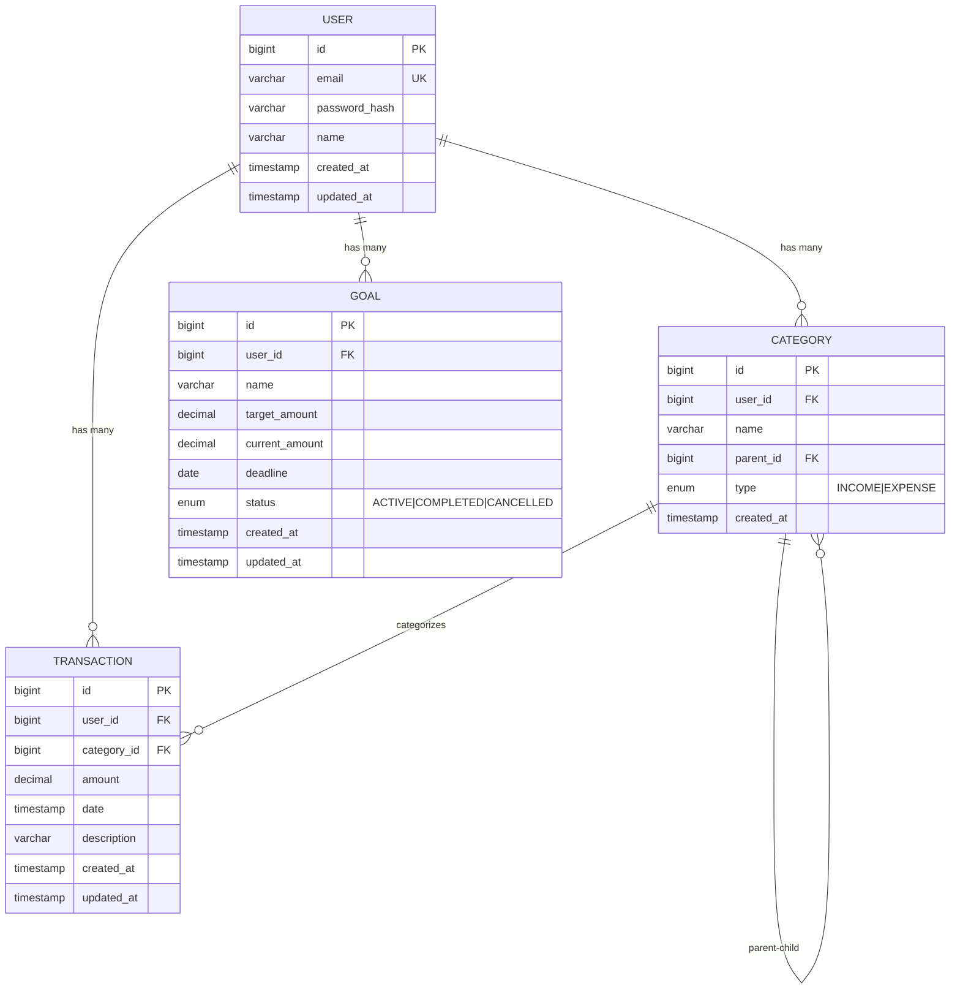

# MoneyTracker Backend — Полная спецификация

## Содержание

1. [Введение](#введение)
2. [Функциональные требования](#функциональные-требования)
3. [Архитектура системы](#архитектура-системы)
4. [Технический стек](#технический-стек)
5. [Модель данных](#модель-данных)
6. [REST API спецификация](#rest-api-спецификация)
7. [Валидация и обработка ошибок](#валидация-и-обработка-ошибок)
8. [Инфраструктура и развёртывание](#инфраструктура-и-развёртывание)
9. [План разработки](#план-разработки)
10. [Чеклист самопроверки](#чеклист-самопроверки)

---

## Введение

### Мотивация проекта

MoneyTracker — это персональная система учёта финансов для контроля доходов, расходов и достижения финансовых целей. Проект решает задачи:

- **Учёт транзакций** — фиксация всех финансовых операций
- **Категоризация** — группировка по статьям расходов/доходов
- **Аналитика** — визуализация и сравнение финансовых показателей
- **Планирование** — постановка и отслеживание финансовых целей
- **Импорт данных** — загрузка истории из Excel

### Целевая аудитория

- Частные пользователи для личного бюджетирования
- Малый бизнес для простого учёта операций

### Что нужно знать разработчику

| Технология | Уровень | Зачем |
|------------|---------|-------|
| Java 17+ | Middle | Основной язык |
| Spring Boot 3.x | Middle | Фреймворк приложения |
| Spring Data JPA | Middle | Работа с БД |
| Spring Security | Middle | JWT аутентификация |
| PostgreSQL | Basic | Хранение данных |
| Liquibase | Basic | Миграции схемы БД |
| Docker | Basic | Контейнеризация |
| JUnit 5, Testcontainers | Basic | Тестирование |

---

## Функциональные требования

### 1. Управление пользователями

| Функция | Описание |
|---------|----------|
| Регистрация | Создание аккаунта с email и паролем |
| Аутентификация | Получение JWT токена по логину/паролю |
| Выход | Отзыв токена (опционально через blacklist) |
| Профиль | Получение/обновление данных пользователя |

### 2. Управление категориями

| Функция | Описание |
|---------|----------|
| Создание категории | Добавление категории с именем, типом, родительской категорией |
| Редактирование | Изменение имени, типа категории |
| Удаление | Удаление категории (если не используется в транзакциях) |
| Иерархия | Поддержка вложенных категорий (родитель → потомки) |
| Типы категорий | EXPENSE (расход), INCOME (доход) |
| Список категорий | Получение всех категорий с фильтрацией по типу |

### 3. Управление транзакциями

| Функция | Описание |
|---------|----------|
| Создание транзакции | Добавление записи о доходе/расходе |
| Редактирование | Изменение суммы, даты, категории, описания |
| Удаление | Удаление транзакции |
| Фильтрация | Поиск по периоду, категории, типу, сумме |
| Пагинация | Постраничный вывод транзакций |

### 4. Аналитика

| Функция | Описание |
|---------|----------|
| Статистика за период | Общая сумма доходов, расходов, баланс, кол-во транзакций |
| Сравнение периодов | Сравнение текущего и предыдущего периода (процент изменения) |
| Накопительный график | Динамика расходов по дням (накопительным итогом) |
| Расходы по категориям | Группировка расходов по категориям (для диаграммы pie chart) |
| Динамика по месяцам | Сравнение месяцев по доходам/расходам |

### 5. Финансовые цели

| Функция | Описание |
|---------|----------|
| Создание цели | Название, целевая сумма, дедлайн, текущая сумма |
| Редактирование цели | Изменение параметров цели |
| Удаление цели | Удаление цели |
| Пополнение цели | Внесение суммы в цель |
| Список целей | Получение всех целей с прогрессом выполнения |
| Прогресс | Автоматический расчёт % достижения цели |

### 6. Импорт/экспорт

| Функция | Описание |
|---------|----------|
| Импорт из Excel | Загрузка файла .xlsx с транзакциями (дата, сумма, категория, описание) |
| Экспорт в Excel | Выгрузка всех транзакций за период в .xlsx |
| Шаблон импорта | Скачивание шаблона Excel для заполнения |

---

## Архитектура системы

### Общая архитектура

```
┌─────────────────────────────────────────────────────────────────┐
│                         Client (Frontend)                        │
│                      React / Mobile App                          │
└─────────────────────────────────────────────────────────────────┘
                              │
                              ▼ HTTP/HTTPS (JSON, JWT)
┌─────────────────────────────────────────────────────────────────┐
│                      API Gateway / Nginx                         │
│                    (SSL termination, proxy)                      │
└─────────────────────────────────────────────────────────────────┘
                              │
                              ▼
┌─────────────────────────────────────────────────────────────────┐
│                    Spring Boot Application                       │
│  ┌─────────────┐  ┌─────────────┐  ┌─────────────────────────┐  │
│  │  Controller │  │   Service   │  │      Repository         │  │
│  │   Layer     │→ │    Layer    │→ │       (JPA)           │  │
│  └─────────────┘  └─────────────┘  └─────────────────────────┘  │
│  ┌─────────────────────────────────────────────────────────────┐│
│  │              Security (JWT Filter, UserDetailsService)      ││
│  └─────────────────────────────────────────────────────────────┘│
└─────────────────────────────────────────────────────────────────┘
                              │
              ┌───────────────┼───────────────┐
              ▼               ▼               ▼
       ┌────────────┐ ┌────────────┐ ┌────────────┐
       │ PostgreSQL │ │    Redis   │ │   MinIO    │
       │   (Data)   │ │  (Sessions │ │   (Files)  │
       │            │ │   Cache)   │ │            │
       └────────────┘ └────────────┘ └────────────┘
```

### Слои приложения

```
┌─────────────────────────────────────────────────────────────┐
│                    Controller Layer                          │
│  - REST endpoints                                            │
│  - Request validation (@Valid)                               │
│  - DTO mapping (Request → Service DTO)                       │
│  - HTTP status codes                                         │
└─────────────────────────────────────────────────────────────┘
                            │
                            ▼
┌─────────────────────────────────────────────────────────────┐
│                     Service Layer                            │
│  - Business logic                                            │
│  - Transaction management (@Transactional)                   │
│  - DTO mapping (Entity → Response DTO)                       │
│  - Integration with external services                        │
└─────────────────────────────────────────────────────────────┘
                            │
                            ▼
┌─────────────────────────────────────────────────────────────┐
│                   Repository Layer                           │
│  - Data access (Spring Data JPA)                             │
│  - Custom queries (@Query, Specifications)                   │
│  - Entity projections                                        │
└─────────────────────────────────────────────────────────────┘
                            │
                            ▼
┌─────────────────────────────────────────────────────────────┐
│                      Entity Layer                            │
│  - JPA entities (@Entity)                                    │
│  - Relationships (@OneToMany, @ManyToOne)                    │
│  - Auditing (@CreatedDate, @LastModifiedDate)                │
└─────────────────────────────────────────────────────────────┘
```

### Компоненты безопасности

```
┌─────────────────────────────────────────────────────────────┐
│                   JWT Authentication Flow                    │
└─────────────────────────────────────────────────────────────┘

1. Регистрация / Вход
   Client ──POST /api/auth/register──→ Server
   Client ←──{ jwtToken, refreshToken }── Server

2. Доступ к защищённым ресурсам
   Client ──GET /api/transactions──→ Server
              Header: Authorization: Bearer <jwtToken>
   
3. Server (JWT Filter)
   ┌─────────────────────────────────────┐
   │ 1. Извлечь токен из заголовка       │
   │ 2. Проверить подпись (secret key)   │
   │ 3. Проверить срок действия          │
   │ 4. Извлечь userId из claims         │
   │ 5. Установить Authentication        │
   └─────────────────────────────────────┘

4. Refresh токена (если access expired)
   Client ──POST /api/auth/refresh──→ Server
              Body: { refreshToken }
   Client ←──{ newAccessToken }── Server
```

---

## Технический стек

### Основные технологии

| Компонент | Технология | Версия | Обоснование |
|-----------|------------|--------|-------------|
| Язык | Java | 17+ | LTS, record patterns, sealed classes |
| Фреймворк | Spring Boot | 3.5.x | Актуальная стабильная версия |
| БД | PostgreSQL | 15+ | Надёжная, JSONB, оконные функции |
| ORM | Hibernate | 6.x | JPA реализация |
| Миграции БД | Liquibase | 4.x | Версионирование схемы |
| Кэш | Redis | 7.x | Сессии, кэширование аналитики |
| Контейнеры | Docker | 24+ | Изоляция окружения |

### Библиотеки

| Назначение | Библиотека |
|------------|------------|
| JWT | `io.jsonwebtoken:jjwt` |
| Валидация | `spring-boot-starter-validation` |
| Lombok | `org.projectlombok:lombok` |
| Excel | `org.apache.poi:poi-ooxml` |
| Тесты | `spring-boot-starter-test`, Testcontainers |
| Документирование API | `springdoc-openapi-starter-webmvc-ui` |

### Структура зависимостей (pom.xml)

```xml
<dependencies>
    <!-- Core -->
    <dependency>
        <groupId>org.springframework.boot</groupId>
        <artifactId>spring-boot-starter-web</artifactId>
    </dependency>
    <dependency>
        <groupId>org.springframework.boot</groupId>
        <artifactId>spring-boot-starter-data-jpa</artifactId>
    </dependency>
    <dependency>
        <groupId>org.springframework.boot</groupId>
        <artifactId>spring-boot-starter-security</artifactId>
    </dependency>
    <dependency>
        <groupId>org.springframework.boot</groupId>
        <artifactId>spring-boot-starter-validation</artifactId>
    </dependency>
    <dependency>
        <groupId>org.springframework.boot</groupId>
        <artifactId>spring-boot-starter-data-redis</artifactId>
    </dependency>
    
    <!-- Database -->
    <dependency>
        <groupId>org.postgresql</groupId>
        <artifactId>postgresql</artifactId>
        <scope>runtime</scope>
    </dependency>
    <dependency>
        <groupId>org.liquibase</groupId>
        <artifactId>liquibase-core</artifactId>
    </dependency>
    
    <!-- JWT -->
    <dependency>
        <groupId>io.jsonwebtoken</groupId>
        <artifactId>jjwt-api</artifactId>
        <version>0.12.3</version>
    </dependency>
    <dependency>
        <groupId>io.jsonwebtoken</groupId>
        <artifactId>jjwt-impl</artifactId>
        <version>0.12.3</version>
        <scope>runtime</scope>
    </dependency>
    <dependency>
        <groupId>io.jsonwebtoken</groupId>
        <artifactId>jjwt-jackson</artifactId>
        <version>0.12.3</version>
        <scope>runtime</scope>
    </dependency>
    
    <!-- Excel -->
    <dependency>
        <groupId>org.apache.poi</groupId>
        <artifactId>poi-ooxml</artifactId>
        <version>5.3.0</version>
    </dependency>
    
    <!-- Lombok -->
    <dependency>
        <groupId>org.projectlombok</groupId>
        <artifactId>lombok</artifactId>
        <optional>true</optional>
    </dependency>
    
    <!-- Swagger/OpenAPI -->
    <dependency>
        <groupId>org.springdoc</groupId>
        <artifactId>springdoc-openapi-starter-webmvc-ui</artifactId>
        <version>2.3.0</version>
    </dependency>
    
    <!-- Test -->
    <dependency>
        <groupId>org.springframework.boot</groupId>
        <artifactId>spring-boot-starter-test</artifactId>
        <scope>test</scope>
    </dependency>
    <dependency>
        <groupId>org.springframework.security</groupId>
        <artifactId>spring-security-test</artifactId>
        <scope>test</scope>
    </dependency>
    <dependency>
        <groupId>org.testcontainers</groupId>
        <artifactId>postgresql</artifactId>
        <scope>test</scope>
    </dependency>
    <dependency>
        <groupId>org.testcontainers</groupId>
        <artifactId>junit-jupiter</artifactId>
        <scope>test</scope>
    </dependency>
</dependencies>
```

---

## Модель данных

### ER-диаграмма



### Описание таблиц

#### users

| Колонка | Тип | Ограничения | Описание |
|---------|-----|-------------|----------|
| id | BIGINT | PRIMARY KEY, AUTO_INCREMENT | ID пользователя |
| email | VARCHAR(255) | UNIQUE, NOT NULL | Email (логин) |
| password_hash | VARCHAR(255) | NOT NULL | Хэш пароля (BCrypt) |
| name | VARCHAR(100) | NOT NULL | Имя пользователя |
| created_at | TIMESTAMP | NOT NULL, DEFAULT NOW() | Дата регистрации |
| updated_at | TIMESTAMP | NULL | Дата обновления профиля |

**Индексы:**
- `idx_users_email` (email) — для поиска по email при аутентификации

#### categories

| Колонка | Тип | Ограничения | Описание |
|---------|-----|-------------|----------|
| id | BIGINT | PRIMARY KEY, AUTO_INCREMENT | ID категории |
| user_id | BIGINT | FOREIGN KEY → users(id), NOT NULL | Владелец категории |
| name | VARCHAR(100) | NOT NULL | Название категории |
| parent_id | BIGINT | FOREIGN KEY → categories(id), NULL | Родительская категория |
| type | ENUM('INCOME', 'EXPENSE') | NOT NULL | Тип категории |
| created_at | TIMESTAMP | NOT NULL, DEFAULT NOW() | Дата создания |

**Индексы:**
- `idx_categories_user_id` (user_id) — для фильтрации по пользователю
- `idx_categories_parent_id` (parent_id) — для построения иерархии
- `idx_categories_type` (type) — для фильтрации по типу
- `idx_categories_user_type` (user_id, type) — составной индекс

**Ограничения:**
- Уникальность: `(name, parent_id, user_id)` — запрет дубликатов в рамках одного родителя

#### transactions

| Колонка | Тип | Ограничения | Описание |
|---------|-----|-------------|----------|
| id | BIGINT | PRIMARY KEY, AUTO_INCREMENT | ID транзакции |
| user_id | BIGINT | FOREIGN KEY → users(id), NOT NULL | Владелец транзакции |
| category_id | BIGINT | FOREIGN KEY → categories(id), NOT NULL | Категория |
| amount | DECIMAL(19,2) | NOT NULL, CHECK (amount > 0) | Сумма |
| date | TIMESTAMP | NOT NULL | Дата операции |
| description | VARCHAR(500) | NULL | Описание |
| created_at | TIMESTAMP | NOT NULL, DEFAULT NOW() | Дата создания записи |
| updated_at | TIMESTAMP | NULL | Дата изменения записи |

**Индексы:**
- `idx_transactions_user_id` (user_id) — для фильтрации по пользователю
- `idx_transactions_date` (date) — для фильтрации по периоду
- `idx_transactions_category_id` (category_id) — для группировки по категориям
- `idx_transactions_user_date` (user_id, date) — составной для выборок пользователя за период

#### goals

| Колонка | Тип | Ограничения | Описание |
|---------|-----|-------------|----------|
| id | BIGINT | PRIMARY KEY, AUTO_INCREMENT | ID цели |
| user_id | BIGINT | FOREIGN KEY → users(id), NOT NULL | Владелец цели |
| name | VARCHAR(200) | NOT NULL | Название цели |
| target_amount | DECIMAL(19,2) | NOT NULL, CHECK (target_amount > 0) | Целевая сумма |
| current_amount | DECIMAL(19,2) | NOT NULL, DEFAULT 0, CHECK (current_amount >= 0) | Текущая сумма |
| deadline | DATE | NULL | Дедлайн достижения |
| status | ENUM('ACTIVE', 'COMPLETED', 'CANCELLED') | NOT NULL, DEFAULT 'ACTIVE' | Статус цели |
| created_at | TIMESTAMP | NOT NULL, DEFAULT NOW() | Дата создания |
| updated_at | TIMESTAMP | NULL | Дата обновления |

**Индексы:**
- `idx_goals_user_id` (user_id) — для фильтрации по пользователю
- `idx_goals_status` (status) — для фильтрации активных/завершённых

### Скрипт Liquibase (changelog.xml)

```xml
<?xml version="1.0" encoding="UTF-8"?>
<databaseChangeLog
        xmlns="http://www.liquibase.org/xml/ns/dbchangelog"
        xmlns:xsi="http://www.w3.org/2001/XMLSchema-instance"
        xsi:schemaLocation="http://www.liquibase.org/xml/ns/dbchangelog
                      http://www.liquibase.org/xml/ns/dbchangelog/dbchangelog-4.20.xsd">

    <!-- Таблица пользователей -->
    <changeSet id="001-create-users" author="developer">
        <createTable tableName="users">
            <column name="id" type="BIGINT" autoIncrement="true">
                <constraints primaryKey="true"/>
            </column>
            <column name="email" type="VARCHAR(255)">
                <constraints nullable="false" unique="true"/>
            </column>
            <column name="password_hash" type="VARCHAR(255)">
                <constraints nullable="false"/>
            </column>
            <column name="name" type="VARCHAR(100)">
                <constraints nullable="false"/>
            </column>
            <column name="created_at" type="TIMESTAMP" defaultValueComputed="CURRENT_TIMESTAMP">
                <constraints nullable="false"/>
            </column>
            <column name="updated_at" type="TIMESTAMP"/>
        </createTable>
        <createIndex tableName="users" indexName="idx_users_email">
            <column name="email"/>
        </createIndex>
    </changeSet>

    <!-- Таблица категорий -->
    <changeSet id="002-create-categories" author="developer">
        <createTable tableName="categories">
            <column name="id" type="BIGINT" autoIncrement="true">
                <constraints primaryKey="true"/>
            </column>
            <column name="user_id" type="BIGINT">
                <constraints nullable="false" foreignKeyName="fk_categories_user" references="users(id)"/>
            </column>
            <column name="name" type="VARCHAR(100)">
                <constraints nullable="false"/>
            </column>
            <column name="parent_id" type="BIGINT">
                <constraints foreignKeyName="fk_categories_parent" references="categories(id)"/>
            </column>
            <column name="type" type="ENUM('INCOME', 'EXPENSE')">
                <constraints nullable="false"/>
            </column>
            <column name="created_at" type="TIMESTAMP" defaultValueComputed="CURRENT_TIMESTAMP">
                <constraints nullable="false"/>
            </column>
        </createTable>
        <addUniqueConstraint tableName="categories" columnNames="name, parent_id, user_id" constraintName="uq_category_name_parent"/>
        <createIndex tableName="categories" indexName="idx_categories_user_id">
            <column name="user_id"/>
        </createIndex>
        <createIndex tableName="categories" indexName="idx_categories_type">
            <column name="type"/>
        </createIndex>
    </changeSet>

    <!-- Таблица транзакций -->
    <changeSet id="003-create-transactions" author="developer">
        <createTable tableName="transactions">
            <column name="id" type="BIGINT" autoIncrement="true">
                <constraints primaryKey="true"/>
            </column>
            <column name="user_id" type="BIGINT">
                <constraints nullable="false" foreignKeyName="fk_transactions_user" references="users(id)"/>
            </column>
            <column name="category_id" type="BIGINT">
                <constraints nullable="false" foreignKeyName="fk_transactions_category" references="categories(id)"/>
            </column>
            <column name="amount" type="DECIMAL(19,2)">
                <constraints nullable="false"/>
            </column>
            <column name="date" type="TIMESTAMP">
                <constraints nullable="false"/>
            </column>
            <column name="description" type="VARCHAR(500)"/>
            <column name="created_at" type="TIMESTAMP" defaultValueComputed="CURRENT_TIMESTAMP">
                <constraints nullable="false"/>
            </column>
            <column name="updated_at" type="TIMESTAMP"/>
        </createTable>
        <createIndex tableName="transactions" indexName="idx_transactions_user_id">
            <column name="user_id"/>
        </createIndex>
        <createIndex tableName="transactions" indexName="idx_transactions_date">
            <column name="date"/>
        </createIndex>
        <createIndex tableName="transactions" indexName="idx_transactions_user_date">
            <column name="user_id"/>
            <column name="date"/>
        </createIndex>
    </changeSet>

    <!-- Таблица целей -->
    <changeSet id="004-create-goals" author="developer">
        <createTable tableName="goals">
            <column name="id" type="BIGINT" autoIncrement="true">
                <constraints primaryKey="true"/>
            </column>
            <column name="user_id" type="BIGINT">
                <constraints nullable="false" foreignKeyName="fk_goals_user" references="users(id)"/>
            </column>
            <column name="name" type="VARCHAR(200)">
                <constraints nullable="false"/>
            </column>
            <column name="target_amount" type="DECIMAL(19,2)">
                <constraints nullable="false"/>
            </column>
            <column name="current_amount" type="DECIMAL(19,2)" defaultValueNumeric="0">
                <constraints nullable="false"/>
            </column>
            <column name="deadline" type="DATE"/>
            <column name="status" type="ENUM('ACTIVE', 'COMPLETED', 'CANCELLED')" defaultValue="ACTIVE">
                <constraints nullable="false"/>
            </column>
            <column name="created_at" type="TIMESTAMP" defaultValueComputed="CURRENT_TIMESTAMP">
                <constraints nullable="false"/>
            </column>
            <column name="updated_at" type="TIMESTAMP"/>
        </createTable>
        <createIndex tableName="goals" indexName="idx_goals_user_id">
            <column name="user_id"/>
        </createIndex>
    </changeSet>

</databaseChangeLog>
```

---

## REST API спецификация

### Базовый URL

```
Production: https://api.moneytracker.ru/api/v1
Development: http://localhost:8080/api/v1
```

### Формат запросов/ответов

**Content-Type:** `application/json`  
**Кодировка:** UTF-8

### Универсальный формат ошибок

```json
{
  "timestamp": "2026-03-26T10:30:00.000Z",
  "status": 400,
  "error": "Bad Request",
  "message": "Поле 'email' должно быть валидным email адресом",
  "path": "/api/v1/auth/register",
  "validationErrors": [
    {
      "field": "email",
      "rejectedValue": "invalid-email",
      "message": "должен быть в формате email"
    }
  ]
}
```

---

## 1. Аутентификация и пользователи

### 1.1 Регистрация

**POST** `/api/v1/auth/register`

**Request Body:**
```json
{
  "email": "user@example.com",
  "password": "SecurePass123!",
  "name": "Иван Петров"
}
```

**Валидация:**
| Поле | Правила |
|------|---------|
| email | required, email format, max 255 |
| password | required, min 8, max 100, хотя бы 1 буква, 1 цифра |
| name | required, min 2, max 100 |

**Response 201 Created:**
```json
{
  "accessToken": "eyJhbGciOiJIUzI1NiIsInR5cCI6IkpXVCJ9...",
  "refreshToken": "dGhpcyBpcyBhIHJlZnJlc2ggdG9rZW4...",
  "tokenType": "Bearer",
  "expiresIn": 900,
  "user": {
    "id": 1,
    "email": "user@example.com",
    "name": "Иван Петров"
  }
}
```

**Response 409 Conflict (email занят):**
```json
{
  "timestamp": "2026-03-26T10:30:00.000Z",
  "status": 409,
  "error": "Conflict",
  "message": "Пользователь с таким email уже существует",
  "path": "/api/v1/auth/register"
}
```

---

### 1.2 Вход (Login)

**POST** `/api/v1/auth/login`

**Request Body:**
```json
{
  "email": "user@example.com",
  "password": "SecurePass123!"
}
```

**Response 200 OK:**
```json
{
  "accessToken": "eyJhbGciOiJIUzI1NiIsInR5cCI6IkpXVCJ9...",
  "refreshToken": "dGhpcyBpcyBhIHJlZnJlc2ggdG9rZW4...",
  "tokenType": "Bearer",
  "expiresIn": 900,
  "user": {
    "id": 1,
    "email": "user@example.com",
    "name": "Иван Петров"
  }
}
```

**Response 401 Unauthorized:**
```json
{
  "timestamp": "2026-03-26T10:30:00.000Z",
  "status": 401,
  "error": "Unauthorized",
  "message": "Неверный email или пароль",
  "path": "/api/v1/auth/login"
}
```

---

### 1.3 Обновление токена (Refresh)

**POST** `/api/v1/auth/refresh`

**Request Body:**
```json
{
  "refreshToken": "dGhpcyBpcyBhIHJlZnJlc2ggdG9rZW4..."
}
```

**Response 200 OK:**
```json
{
  "accessToken": "eyJhbGciOiJIUzI1NiIsInR5cCI6IkpXVCJ9...",
  "expiresIn": 900
}
```

**Response 401 Unauthorized:**
```json
{
  "timestamp": "2026-03-26T10:30:00.000Z",
  "status": 401,
  "error": "Unauthorized",
  "message": "Refresh токен истёк или недействителен",
  "path": "/api/v1/auth/refresh"
}
```

---

### 1.4 Выход (Logout)

**POST** `/api/v1/auth/logout`

**Headers:**
```
Authorization: Bearer <accessToken>
```

**Response 204 No Content**

---

### 1.5 Получение профиля

**GET** `/api/v1/users/me`

**Headers:**
```
Authorization: Bearer <accessToken>
```

**Response 200 OK:**
```json
{
  "id": 1,
  "email": "user@example.com",
  "name": "Иван Петров",
  "createdAt": "2026-01-15T08:00:00.000Z"
}
```

---

### 1.6 Обновление профиля

**PUT** `/api/v1/users/me`

**Headers:**
```
Authorization: Bearer <accessToken>
```

**Request Body:**
```json
{
  "name": "Иван Иванович Петров"
}
```

**Response 200 OK:**
```json
{
  "id": 1,
  "email": "user@example.com",
  "name": "Иван Иванович Петров",
  "createdAt": "2026-01-15T08:00:00.000Z"
}
```

---

### 1.7 Смена пароля

**PUT** `/api/v1/users/me/password`

**Headers:**
```
Authorization: Bearer <accessToken>
```

**Request Body:**
```json
{
  "currentPassword": "OldPass123!",
  "newPassword": "NewSecurePass456!"
}
```

**Response 204 No Content**

**Response 400 Bad Request (неверный текущий пароль):**
```json
{
  "timestamp": "2026-03-26T10:30:00.000Z",
  "status": 400,
  "error": "Bad Request",
  "message": "Текущий пароль указан неверно",
  "path": "/api/v1/users/me/password"
}
```

---

## 2. Категории

### 2.1 Создание категории

**POST** `/api/v1/categories`

**Headers:**
```
Authorization: Bearer <accessToken>
```

**Request Body:**
```json
{
  "name": "Продукты",
  "type": "EXPENSE",
  "parentId": null
}
```

**Валидация:**
| Поле | Правила |
|------|---------|
| name | required, min 1, max 100 |
| type | required, enum: INCOME, EXPENSE |
| parentId | optional, должен существовать и принадлежать пользователю |

**Response 201 Created:**
```json
{
  "id": 1,
  "name": "Продукты",
  "type": "EXPENSE",
  "parent": null,
  "createdAt": "2026-03-26T10:30:00.000Z"
}
```

**Response 400 Bad Request:**
```json
{
  "timestamp": "2026-03-26T10:30:00.000Z",
  "status": 400,
  "error": "Bad Request",
  "message": "Родительская категория должна быть того же типа",
  "path": "/api/v1/categories"
}
```

**Response 409 Conflict (дубликат):**
```json
{
  "timestamp": "2026-03-26T10:30:00.000Z",
  "status": 409,
  "error": "Conflict",
  "message": "Категория с таким именем уже существует",
  "path": "/api/v1/categories"
}
```

---

### 2.2 Список категорий

**GET** `/api/v1/categories`

**Headers:**
```
Authorization: Bearer <accessToken>
```

**Query Parameters:**
| Параметр | Тип | Описание |
|----------|-----|----------|
| type | enum | Фильтр по типу (INCOME, EXPENSE) |
| parentId | long | Фильтр по родителю (только дочерние) |
| includeChildren | boolean | Включить вложенные (default: false) |

**Response 200 OK:**
```json
[
  {
    "id": 1,
    "name": "Продукты",
    "type": "EXPENSE",
    "parent": null,
    "children": [],
    "createdAt": "2026-03-26T10:30:00.000Z"
  },
  {
    "id": 2,
    "name": "Молоко",
    "type": "EXPENSE",
    "parent": {
      "id": 1,
      "name": "Продукты"
    },
    "children": [],
    "createdAt": "2026-03-26T10:35:00.000Z"
  }
]
```

---

### 2.3 Получение категории

**GET** `/api/v1/categories/{id}`

**Headers:**
```
Authorization: Bearer <accessToken>
```

**Response 200 OK:**
```json
{
  "id": 1,
  "name": "Продукты",
  "type": "EXPENSE",
  "parent": null,
  "children": [
    {
      "id": 2,
      "name": "Молоко"
    }
  ],
  "createdAt": "2026-03-26T10:30:00.000Z"
}
```

**Response 404 Not Found:**
```json
{
  "timestamp": "2026-03-26T10:30:00.000Z",
  "status": 404,
  "error": "Not Found",
  "message": "Категория не найдена",
  "path": "/api/v1/categories/999"
}
```

---

### 2.4 Обновление категории

**PUT** `/api/v1/categories/{id}`

**Headers:**
```
Authorization: Bearer <accessToken>
```

**Request Body:**
```json
{
  "name": "Продукты и товары для дома",
  "parentId": null
}
```

**Response 200 OK:**
```json
{
  "id": 1,
  "name": "Продукты и товары для дома",
  "type": "EXPENSE",
  "parent": null,
  "createdAt": "2026-03-26T10:30:00.000Z",
  "updatedAt": "2026-03-26T11:00:00.000Z"
}
```

---

### 2.5 Удаление категории

**DELETE** `/api/v1/categories/{id}`

**Headers:**
```
Authorization: Bearer <accessToken>
```

**Response 204 No Content**

**Response 400 Bad Request (категория используется):**
```json
{
  "timestamp": "2026-03-26T10:30:00.000Z",
  "status": 400,
  "error": "Bad Request",
  "message": "Невозможно удалить категорию: она используется в 5 транзакциях",
  "path": "/api/v1/categories/1"
}
```

**Response 404 Not Found:**
```json
{
  "timestamp": "2026-03-26T10:30:00.000Z",
  "status": 404,
  "error": "Not Found",
  "message": "Категория не найдена",
  "path": "/api/v1/categories/999"
}
```

---

## 3. Транзакции

### 3.1 Создание транзакции

**POST** `/api/v1/transactions`

**Headers:**
```
Authorization: Bearer <accessToken>
```

**Request Body:**
```json
{
  "amount": 1500.50,
  "categoryId": 1,
  "date": "2026-03-26T10:30:00",
  "description": "Покупка в супермаркете"
}
```

**Валидация:**
| Поле | Правила |
|------|---------|
| amount | required, positive, max 10000000, 2 знака после запятой |
| categoryId | required, должна существовать |
| date | required, не в будущем (опционально) |
| description | optional, max 500 |

**Response 201 Created:**
```json
{
  "id": 1,
  "amount": 1500.50,
  "category": {
    "id": 1,
    "name": "Продукты",
    "type": "EXPENSE"
  },
  "date": "2026-03-26T10:30:00.000Z",
  "description": "Покупка в супермаркете",
  "type": "EXPENSE",
  "createdAt": "2026-03-26T10:30:00.000Z"
}
```

---

### 3.2 Список транзакций (с фильтрацией и пагинацией)

**GET** `/api/v1/transactions`

**Headers:**
```
Authorization: Bearer <accessToken>
```

**Query Parameters:**
| Параметр | Тип | Описание |
|----------|-----|----------|
| startDate | date | Начало периода (ISO 8601) |
| endDate | date | Конец периода (ISO 8601) |
| categoryId | long | Фильтр по категории |
| type | enum | Фильтр по типу (INCOME, EXPENSE) |
| minAmount | decimal | Минимальная сумма |
| maxAmount | decimal | Максимальная сумма |
| search | string | Поиск по описанию |
| page | int | Номер страницы (default: 0) |
| size | int | Размер страницы (default: 20, max: 100) |
| sortBy | string | Сортировка: date, amount, createdAt |
| sortDir | enum | Направление: asc, desc (default: desc) |

**Response 200 OK:**
```json
{
  "content": [
    {
      "id": 1,
      "amount": 1500.50,
      "category": {
        "id": 1,
        "name": "Продукты",
        "type": "EXPENSE"
      },
      "date": "2026-03-26T10:30:00.000Z",
      "description": "Покупка в супермаркете",
      "type": "EXPENSE",
      "createdAt": "2026-03-26T10:30:00.000Z"
    }
  ],
  "pageable": {
    "pageNumber": 0,
    "pageSize": 20,
    "sort": {
      "sorted": true,
      "unsorted": false,
      "direction": "DESC"
    }
  },
  "totalElements": 150,
  "totalPages": 8,
  "last": false,
  "first": true,
  "numberOfElements": 20,
  "empty": false
}
```

---

### 3.3 Получение транзакции

**GET** `/api/v1/transactions/{id}`

**Headers:**
```
Authorization: Bearer <accessToken>
```

**Response 200 OK:**
```json
{
  "id": 1,
  "amount": 1500.50,
  "category": {
    "id": 1,
    "name": "Продукты",
    "type": "EXPENSE",
    "parent": null
  },
  "date": "2026-03-26T10:30:00.000Z",
  "description": "Покупка в супермаркете",
  "type": "EXPENSE",
  "createdAt": "2026-03-26T10:30:00.000Z",
  "updatedAt": null
}
```

**Response 404 Not Found:**
```json
{
  "timestamp": "2026-03-26T10:30:00.000Z",
  "status": 404,
  "error": "Not Found",
  "message": "Транзакция не найдена",
  "path": "/api/v1/transactions/999"
}
```

---

### 3.4 Обновление транзакции

**PUT** `/api/v1/transactions/{id}`

**Headers:**
```
Authorization: Bearer <accessToken>
```

**Request Body:**
```json
{
  "amount": 1600.00,
  "categoryId": 2,
  "date": "2026-03-26T10:30:00",
  "description": "Покупка продуктов на неделю"
}
```

**Response 200 OK:**
```json
{
  "id": 1,
  "amount": 1600.00,
  "category": {
    "id": 2,
    "name": "Молоко",
    "type": "EXPENSE"
  },
  "date": "2026-03-26T10:30:00.000Z",
  "description": "Покупка продуктов на неделю",
  "type": "EXPENSE",
  "createdAt": "2026-03-26T10:30:00.000Z",
  "updatedAt": "2026-03-26T11:00:00.000Z"
}
```

---

### 3.5 Удаление транзакции

**DELETE** `/api/v1/transactions/{id}`

**Headers:**
```
Authorization: Bearer <accessToken>
```

**Response 204 No Content**

---

## 4. Аналитика

### 4.1 Статистика расходов за период

**GET** `/api/v1/analytics/stats`

**Headers:**
```
Authorization: Bearer <accessToken>
```

**Query Parameters:**
| Параметр | Тип | Описание |
|----------|-----|----------|
| startDate | date | Начало периода |
| endDate | date | Конец периода |

**Response 200 OK:**
```json
{
  "totalExpense": 45000.00,
  "totalIncome": 80000.00,
  "balance": 35000.00,
  "transactionCount": 42,
  "averageDailyExpense": 1500.00,
  "period": {
    "startDate": "2026-03-01",
    "endDate": "2026-03-31",
    "days": 31
  }
}
```

---

### 4.2 Сравнение периодов

**GET** `/api/v1/analytics/compare`

**Headers:**
```
Authorization: Bearer <accessToken>
```

**Query Parameters:**
| Параметр | Тип | Описание |
|----------|-----|----------|
| startDate | date | Начало текущего периода |
| endDate | date | Конец текущего периода |

**Response 200 OK:**
```json
{
  "currentPeriod": {
    "startDate": "2026-03-01",
    "endDate": "2026-03-31",
    "totalExpense": 45000.00,
    "totalIncome": 80000.00,
    "balance": 35000.00,
    "transactionCount": 42
  },
  "previousPeriod": {
    "startDate": "2026-02-01",
    "endDate": "2026-02-28",
    "totalExpense": 50000.00,
    "totalIncome": 75000.00,
    "balance": 25000.00,
    "transactionCount": 38
  },
  "changes": {
    "expenseChangePercent": -10.00,
    "incomeChangePercent": 6.67,
    "balanceChangePercent": 40.00
  }
}
```

**Интерпретация изменений:**
- `expenseChangePercent: -10.00` — расходы уменьшились на 10%
- `incomeChangePercent: 6.67` — доходы выросли на 6.67%
- `balanceChangePercent: 40.00` — баланс вырос на 40%

---

### 4.3 Накопительный график расходов

**GET** `/api/v1/analytics/cumulative`

**Headers:**
```
Authorization: Bearer <accessToken>
```

**Query Parameters:**
| Параметр | Тип | Описание |
|----------|-----|----------|
| startDate | date | Начало периода |
| endDate | date | Конец периода |

**Response 200 OK:**
```json
[
  {
    "date": "2026-03-01",
    "dailyAmount": 1200.00,
    "cumulativeAmount": 1200.00
  },
  {
    "date": "2026-03-02",
    "dailyAmount": 800.00,
    "cumulativeAmount": 2000.00
  },
  {
    "date": "2026-03-03",
    "dailyAmount": 2500.00,
    "cumulativeAmount": 4500.00
  }
]
```

---

### 4.4 Расходы по категориям

**GET** `/api/v1/analytics/by-category`

**Headers:**
```
Authorization: Bearer <accessToken>
```

**Query Parameters:**
| Параметр | Тип | Описание |
|----------|-----|----------|
| startDate | date | Начало периода |
| endDate | date | Конец периода |

**Response 200 OK:**
```json
[
  {
    "category": {
      "id": 1,
      "name": "Продукты",
      "type": "EXPENSE"
    },
    "amount": 15000.00,
    "percentage": 33.33
  },
  {
    "category": {
      "id": 3,
      "name": "Транспорт",
      "type": "EXPENSE"
    },
    "amount": 8000.00,
    "percentage": 17.78
  },
  {
    "category": {
      "id": 5,
      "name": "Развлечения",
      "type": "EXPENSE"
    },
    "amount": 5000.00,
    "percentage": 11.11
  }
]
```

---

### 4.5 Динамика по месяцам

**GET** `/api/v1/analytics/monthly-trend`

**Headers:**
```
Authorization: Bearer <accessToken>
```

**Query Parameters:**
| Параметр | Тип | Описание |
|----------|-----|----------|
| months | int | Количество месяцев (default: 12, max: 24) |

**Response 200 OK:**
```json
[
  {
    "month": "2025-04",
    "income": 75000.00,
    "expense": 48000.00,
    "balance": 27000.00
  },
  {
    "month": "2025-05",
    "income": 78000.00,
    "expense": 52000.00,
    "balance": 26000.00
  },
  {
    "month": "2025-06",
    "income": 80000.00,
    "expense": 45000.00,
    "balance": 35000.00
  }
]
```

---

## 5. Финансовые цели

### 5.1 Создание цели

**POST** `/api/v1/goals`

**Headers:**
```
Authorization: Bearer <accessToken>
```

**Request Body:**
```json
{
  "name": "Накопить на отпуск",
  "targetAmount": 150000.00,
  "deadline": "2026-12-31",
  "initialAmount": 10000.00
}
```

**Валидация:**
| Поле | Правила |
|------|---------|
| name | required, min 3, max 200 |
| targetAmount | required, positive, max 100000000 |
| deadline | optional, должна быть в будущем |
| initialAmount | optional, >= 0, <= targetAmount |

**Response 201 Created:**
```json
{
  "id": 1,
  "name": "Накопить на отпуск",
  "targetAmount": 150000.00,
  "currentAmount": 10000.00,
  "deadline": "2026-12-31",
  "status": "ACTIVE",
  "progressPercent": 6.67,
  "remainingAmount": 140000.00,
  "createdAt": "2026-03-26T10:30:00.000Z"
}
```

---

### 5.2 Список целей

**GET** `/api/v1/goals`

**Headers:**
```
Authorization: Bearer <accessToken>
```

**Query Parameters:**
| Параметр | Тип | Описание |
|----------|-----|----------|
| status | enum | Фильтр по статусу (ACTIVE, COMPLETED, CANCELLED) |

**Response 200 OK:**
```json
[
  {
    "id": 1,
    "name": "Накопить на отпуск",
    "targetAmount": 150000.00,
    "currentAmount": 25000.00,
    "deadline": "2026-12-31",
    "status": "ACTIVE",
    "progressPercent": 16.67,
    "remainingAmount": 125000.00,
    "createdAt": "2026-03-26T10:30:00.000Z",
    "updatedAt": "2026-03-28T14:00:00.000Z"
  },
  {
    "id": 2,
    "name": "Подушка безопасности",
    "targetAmount": 300000.00,
    "currentAmount": 300000.00,
    "deadline": null,
    "status": "COMPLETED",
    "progressPercent": 100.00,
    "remainingAmount": 0.00,
    "createdAt": "2025-01-01T00:00:00.000Z",
    "updatedAt": "2026-03-01T10:00:00.000Z"
  }
]
```

---

### 5.3 Получение цели

**GET** `/api/v1/goals/{id}`

**Headers:**
```
Authorization: Bearer <accessToken>
```

**Response 200 OK:**
```json
{
  "id": 1,
  "name": "Накопить на отпуск",
  "targetAmount": 150000.00,
  "currentAmount": 25000.00,
  "deadline": "2026-12-31",
  "status": "ACTIVE",
  "progressPercent": 16.67,
  "remainingAmount": 125000.00,
  "dailyTarget": 538.46,
  "createdAt": "2026-03-26T10:30:00.000Z",
  "updatedAt": "2026-03-28T14:00:00.000Z"
}
```

**dailyTarget** — сколько нужно откладывать в день для достижения цели к дедлайну.

---

### 5.4 Обновление цели

**PUT** `/api/v1/goals/{id}`

**Headers:**
```
Authorization: Bearer <accessToken>
```

**Request Body:**
```json
{
  "name": "Накопить на большой отпуск",
  "targetAmount": 200000.00,
  "deadline": "2027-06-30"
}
```

**Response 200 OK:**
```json
{
  "id": 1,
  "name": "Накопить на большой отпуск",
  "targetAmount": 200000.00,
  "currentAmount": 25000.00,
  "deadline": "2027-06-30",
  "status": "ACTIVE",
  "progressPercent": 12.50,
  "remainingAmount": 175000.00,
  "updatedAt": "2026-03-28T15:00:00.000Z"
}
```

---

### 5.5 Пополнение цели

**POST** `/api/v1/goals/{id}/contribute`

**Headers:**
```
Authorization: Bearer <accessToken>
```

**Request Body:**
```json
{
  "amount": 5000.00
}
```

**Response 200 OK:**
```json
{
  "id": 1,
  "name": "Накопить на отпуск",
  "targetAmount": 150000.00,
  "currentAmount": 30000.00,
  "deadline": "2026-12-31",
  "status": "ACTIVE",
  "progressPercent": 20.00,
  "remainingAmount": 120000.00
}
```

---

### 5.6 Удаление цели

**DELETE** `/api/v1/goals/{id}`

**Headers:**
```
Authorization: Bearer <accessToken>
```

**Response 204 No Content**

---

## 6. Импорт/экспорт

### 6.1 Импорт транзакций из Excel

**POST** `/api/v1/import/excel`

**Headers:**
```
Authorization: Bearer <accessToken>
Content-Type: multipart/form-data
```

**Request Body (multipart/form-data):**
| Поле | Тип | Описание |
|------|-----|----------|
| file | file | Excel файл (.xlsx) |
| createCategories | boolean | Создавать категории, если не существуют (default: true) |
| defaultCategoryId | long | Категория по умолчанию для не распознанных |

**Формат Excel файла:**

| Column A | Column B | Column C | Column D |
|----------|----------|----------|----------|
| **Дата** | **Сумма** | **Категория** | **Описание** |
| 2026-03-26 | 1500.50 | Продукты | Покупка в супермаркете |
| 2026-03-25 | 300.00 | Транспорт | Метро |

**Response 200 OK:**
```json
{
  "imported": 45,
  "skipped": 3,
  "errors": [
    {
      "row": 10,
      "message": "Неверный формат даты в ячейке A10"
    },
    {
      "row": 15,
      "message": "Отрицательная сумма в ячейке B15"
    }
  ],
  "categoriesCreated": [
    {
      "name": "Продукты",
      "id": 1
    },
    {
      "name": "Транспорт",
      "id": 2
    }
  ]
}
```

---

### 6.2 Экспорт транзакций в Excel

**GET** `/api/v1/export/excel`

**Headers:**
```
Authorization: Bearer <accessToken>
```

**Query Parameters:**
| Параметр | Тип | Описание |
|----------|-----|----------|
| startDate | date | Начало периода |
| endDate | date | Конец периода |

**Response 200 OK:**
- **Content-Type:** `application/vnd.openxmlformats-officedocument.spreadsheetml.sheet`
- **Content-Disposition:** `attachment; filename="transactions_2026-03-01_2026-03-31.xlsx"`

---

### 6.3 Шаблон для импорта

**GET** `/api/v1/import/template`

**Headers:**
```
Authorization: Bearer <accessToken>
```

**Response 200 OK:**
- **Content-Type:** `application/vnd.openxmlformats-officedocument.spreadsheetml.sheet`
- **Content-Disposition:** `attachment; filename="import_template.xlsx"`

---

## Валидация и обработка ошибок

### Глобальный обработчик исключений

```java
@RestControllerAdvice
public class GlobalExceptionHandler {

    @ExceptionHandler(MethodArgumentNotValidException.class)
    @ResponseStatus(HttpStatus.BAD_REQUEST)
    public ErrorResponse handleValidation(MethodArgumentNotValidException ex) {
        List<ValidationError> errors = ex.getBindingResult()
            .getFieldErrors()
            .stream()
            .map(error -> new ValidationError(
                error.getField(),
                error.getRejectedValue(),
                error.getDefaultMessage()
            ))
            .toList();
        
        return new ErrorResponse(
            LocalDateTime.now(),
            HttpStatus.BAD_REQUEST.value(),
            "Ошибка валидации",
            errors
        );
    }

    @ExceptionHandler(CategoryInUseException.class)
    @ResponseStatus(HttpStatus.BAD_REQUEST)
    public ErrorResponse handleCategoryInUse(CategoryInUseException ex) {
        return new ErrorResponse(
            LocalDateTime.now(),
            HttpStatus.BAD_REQUEST.value(),
            ex.getMessage(),
            null
        );
    }

    @ExceptionHandler(EntityNotFoundException.class)
    @ResponseStatus(HttpStatus.NOT_FOUND)
    public ErrorResponse handleNotFound(EntityNotFoundException ex) {
        return new ErrorResponse(
            LocalDateTime.now(),
            HttpStatus.NOT_FOUND.value(),
            ex.getMessage(),
            null
        );
    }

    @ExceptionHandler(AuthenticationException.class)
    @ResponseStatus(HttpStatus.UNAUTHORIZED)
    public ErrorResponse handleAuth(AuthenticationException ex) {
        return new ErrorResponse(
            LocalDateTime.now(),
            HttpStatus.UNAUTHORIZED.value(),
            "Ошибка аутентификации",
            null
        );
    }

    @ExceptionHandler(Exception.class)
    @ResponseStatus(HttpStatus.INTERNAL_SERVER_ERROR)
    public ErrorResponse handleGeneric(Exception ex) {
        log.error("Unexpected error", ex);
        return new ErrorResponse(
            LocalDateTime.now(),
            HttpStatus.INTERNAL_SERVER_ERROR.value(),
            "Внутренняя ошибка сервера",
            null
        );
    }
}
```

### Классы ошибок

```java
public record ErrorResponse(
    LocalDateTime timestamp,
    int status,
    String error,
    String message,
    String path,
    List<ValidationError> validationErrors
) {}

public record ValidationError(
    String field,
    Object rejectedValue,
    String message
) {}
```

### Коды HTTP статусов

| Код | Значение | Когда используется |
|-----|----------|-------------------|
| 200 | OK | Успешный GET, PUT |
| 201 | Created | Успешный POST (создание ресурса) |
| 204 | No Content | Успешный DELETE |
| 400 | Bad Request | Ошибка валидации, бизнес-логика |
| 401 | Unauthorized | Нет токена, истёк, неверные credentials |
| 403 | Forbidden | Нет прав на ресурс (чужая транзакция) |
| 404 | Not Found | Ресурс не найден |
| 409 | Conflict | Дубликат (email, категория) |
| 422 | Unprocessable Entity | Ошибка логики (нельзя удалить используемую категорию) |
| 500 | Internal Server Error | Неожиданная ошибка сервера |

---

## Инфраструктура и развёртывание

### Docker Compose (development)

```yaml
version: '3.8'

services:
  app:
    build:
      context: ./backend
      dockerfile: Dockerfile
    container_name: moneytracker-backend
    ports:
      - "8080:8080"
    environment:
      - SPRING_PROFILES_ACTIVE=dev
      - DB_HOST=postgres
      - DB_PORT=5432
      - DB_NAME=moneytracker
      - DB_USER=postgres
      - DB_PASSWORD=postgres
      - REDIS_HOST=redis
      - REDIS_PORT=6379
      - JWT_SECRET=your-secret-key-change-in-production
    depends_on:
      postgres:
        condition: service_healthy
      redis:
        condition: service_started
    volumes:
      - ./backend/logs:/app/logs

  postgres:
    image: postgres:15-alpine
    container_name: moneytracker-db
    ports:
      - "5432:5432"
    environment:
      - POSTGRES_DB=moneytracker
      - POSTGRES_USER=postgres
      - POSTGRES_PASSWORD=postgres
    volumes:
      - postgres_data:/var/lib/postgresql/data
    healthcheck:
      test: ["CMD-SHELL", "pg_isready -U postgres"]
      interval: 5s
      timeout: 5s
      retries: 5

  redis:
    image: redis:7-alpine
    container_name: moneytracker-redis
    ports:
      - "6379:6379"
    volumes:
      - redis_data:/data

volumes:
  postgres_data:
  redis_data:
```

### Docker Compose (production)

```yaml
version: '3.8'

services:
  app:
    build:
      context: ./backend
      dockerfile: Dockerfile
    container_name: moneytracker-backend
    environment:
      - SPRING_PROFILES_ACTIVE=prod
      - DB_HOST=postgres
      - DB_PORT=5432
      - DB_NAME=moneytracker
      - DB_USER=${DB_USER}
      - DB_PASSWORD=${DB_PASSWORD}
      - REDIS_HOST=redis
      - REDIS_PORT=6379
      - JWT_SECRET=${JWT_SECRET}
    depends_on:
      postgres:
        condition: service_healthy
      redis:
        condition: service_started
    networks:
      - moneytracker-network
    restart: unless-stopped

  postgres:
    image: postgres:15-alpine
    container_name: moneytracker-db
    environment:
      - POSTGRES_DB=moneytracker
      - POSTGRES_USER=${DB_USER}
      - POSTGRES_PASSWORD=${DB_PASSWORD}
    volumes:
      - postgres_data:/var/lib/postgresql/data
    healthcheck:
      test: ["CMD-SHELL", "pg_isready -U ${DB_USER}"]
      interval: 5s
      timeout: 5s
      retries: 5
    networks:
      - moneytracker-network
    restart: unless-stopped

  redis:
    image: redis:7-alpine
    container_name: moneytracker-redis
    command: redis-server --requirepass ${REDIS_PASSWORD}
    volumes:
      - redis_data:/data
    networks:
      - moneytracker-network
    restart: unless-stopped

  nginx:
    image: nginx:alpine
    container_name: moneytracker-nginx
    ports:
      - "80:80"
      - "443:443"
    volumes:
      - ./nginx/nginx.conf:/etc/nginx/nginx.conf
      - ./nginx/ssl:/etc/nginx/ssl
    depends_on:
      - app
    networks:
      - moneytracker-network
    restart: unless-stopped

networks:
  moneytracker-network:
    driver: bridge

volumes:
  postgres_data:
  redis_data:
```

### Dockerfile (backend)

```dockerfile
# Build stage
FROM maven:3.9-eclipse-temurin-17 AS builder
WORKDIR /build
COPY pom.xml .
RUN mvn dependency:go-offline
COPY src ./src
RUN mvn clean package -DskipTests

# Runtime stage
FROM eclipse-temurin:17-jre-alpine
WORKDIR /app
COPY --from=builder /build/target/app.jar ./app.jar

# Create non-root user
RUN addgroup -g 1001 appgroup && \
    adduser -u 1001 -G appgroup -D appuser
USER appuser

# Health check
HEALTHCHECK --interval=30s --timeout=3s --start-period=60s --retries=3 \
    CMD wget -qO- http://localhost:8080/api/v1/health || exit 1

EXPOSE 8080
ENTRYPOINT ["java", "-jar", "app.jar"]
```

### Переменные окружения

| Переменная | Описание | Default | Required |
|------------|----------|---------|----------|
| SPRING_PROFILES_ACTIVE | Профиль Spring | dev | Нет |
| DB_HOST | Хост PostgreSQL | localhost | Да |
| DB_PORT | Порт PostgreSQL | 5432 | Да |
| DB_NAME | Имя БД | moneytracker | Да |
| DB_USER | Пользователь БД | postgres | Да |
| DB_PASSWORD | Пароль БД | postgres | Да |
| REDIS_HOST | Хост Redis | localhost | Да |
| REDIS_PORT | Порт Redis | 6379 | Да |
| REDIS_PASSWORD | Пароль Redis | - | Для prod |
| JWT_SECRET | Секретный ключ JWT | - | Да |
| JWT_EXPIRATION | Время жизни access токена (мс) | 900000 | Нет |
| JWT_REFRESH_EXPIRATION | Время жизни refresh токена (мс) | 604800000 | Нет |

---

## План разработки

### Этап 1: Настройка проекта (2-3 дня)

- [ ] Инициализация Spring Boot проекта (или обновление существующего)
- [ ] Настройка pom.xml со всеми зависимостями
- [ ] Настройка application.yml (dev/prod профили)
- [ ] Настройка Docker Compose (PostgreSQL, Redis)
- [ ] Создание первого changelog Liquibase
- [ ] Настройка Swagger UI

### Этап 2: Модели и репозитории (2-3 дня)

- [ ] Entity: User, Category, Transaction, Goal
- [ ] Repository interfaces с custom queries
- [ ] Entity projections для аналитики
- [ ] Индексы и ограничения в Liquibase
- [ ] Unit-тесты репозиториев (Testcontainers)

### Этап 3: Безопасность (2-3 дня)

- [ ] Spring Security конфигурация
- [ ] JWT Filter для обработки токенов
- [ ] JwtTokenProvider (generate, validate, extract claims)
- [ ] UserDetailsService реализация
- [ ] AuthController (register, login, refresh, logout)
- [ ] Unit-тесты безопасности

### Этап 4: Сервисы категорий и транзакций (3-4 дня)

- [ ] CategoryService (CRUD, валидация иерархии)
- [ ] TransactionService (CRUD, фильтрация)
- [ ] CategoryController
- [ ] TransactionController
- [ ] Integration-тесты API

### Этап 5: Аналитика (2-3 дня)

- [ ] AnalyticsService (статистика, сравнение, группировки)
- [ ] AnalyticsController
- [ ] Оптимизация SQL запросов (индексы, projection)
- [ ] Кэширование аналитики в Redis (опционально)
- [ ] Unit-тесты сервисов аналитики

### Этап 6: Финансовые цели (2-3 дня)

- [ ] Goal entity и repository
- [ ] GoalService (CRUD, расчёт прогресса, пополнение)
- [ ] GoalController
- [ ] Unit-тесты логики целей

### Этап 7: Импорт/экспорт (2-3 дня)

- [ ] ExcelImportService (парсинг .xlsx)
- [ ] ExcelExportService (генерация .xlsx)
- [ ] ImportController
- [ ] ExportController
- [ ] Integration-тесты импорта

### Этап 8: Обработка ошибок и валидация (1-2 дня)

- [ ] GlobalExceptionHandler
- [ ] Custom exceptions (CategoryInUseException, etc.)
- [ ] DTO валидация (@Valid, custom validators)
- [ ] Unit-тесты обработчиков

### Этап 9: Тестирование (3-4 дня)

- [ ] Unit-тесты сервисов (покрытие >80%)
- [ ] Integration-тесты контроллеров
- [ ] Integration-тесты с Testcontainers
- [ ] API contract tests
- [ ] Load tests (опционально)

### Этап 10: Документирование и деплой (2-3 дня)

- [ ] Swagger документация (OpenAPI annotations)
- [ ] README с инструкциями
- [ ] Production Docker Compose
- [ ] Nginx конфигурация
- [ ] CI/CD pipeline (GitHub Actions / GitLab CI)
- [ ] Deploy на сервер

**Итого:** ~25-35 рабочих дней

---

## Чеклист самопроверки

### Безопасность

- [ ] Пароли хэшируются BCrypt (strength >= 10)
- [ ] JWT secret хранится в environment variables
- [ ] Access токен имеет короткое время жизни (15 мин)
- [ ] Refresh токен имеет длительное время жизни (7 дней)
- [ ] Все эндпоинты кроме auth защищены
- [ ] Проверка прав доступа (пользователь видит только свои данные)
- [ ] SQL injection защищены (JPA parameters)
- [ ] XSS защищены (санитайзинг вывода)

### Валидация

- [ ] Все входные DTO валидируются (@Valid)
- [ ] Проверка на null/empty для обязательных полей
- [ ] Проверка форматов (email, date)
- [ ] Проверка диапазонов (min/max для sum)
- [ ] Проверка уникальности (email, категория)
- [ ] Проверка бизнес-правил (категория того же типа)

### Обработка ошибок

- [ ] Единый формат ошибок (timestamp, status, message, path)
- [ ] Детализация ошибок валидации (поле, значение, сообщение)
- [ ] Логируются все ошибки 5xx
- [ ] Не утекают стектрейсы в production
- [ ] Корректные HTTP статусы (400, 401, 404, 409, 500)

### Транзакционность

- [ ] @Transactional на сервисах (write операции)
- [ ] @Transactional(readOnly = true) на read методах
- [ ] Откат транзакции при исключениях
- [ ] Нет N+1 запросов (JOIN FETCH, EntityGraph)

### База данных

- [ ] Все таблицы имеют первичные ключи
- [ ] Foreign keys с правильными действиями (CASCADE, RESTRICT)
- [ ] Индексы на часто используемых полях (user_id, date)
- [ ] Составные индексы для фильтрации (user_id, date)
- [ ] Liquibase миграции идемпотентны
- [ ] Есть индексы для UNIQUE constraints

### Производительность

- [ ] Пагинация для списков (Pageable)
- [ ] Ограничение max размера страницы
- [ ] Кэширование частых запросов (Redis)
- [ ] Нет утечек памяти (Stream API, большие файлы)
- [ ] Connection pool настроен (HikariCP)

### Тестирование

- [ ] Unit-тесты сервисов (mock repositories)
- [ ] Integration-тесты контроллеров (@SpringBootTest)
- [ ] Integration-тесты с Testcontainers (реальная БД)
- [ ] Покрытие кода тестами >80%
- [ ] Тесты на граничные случаи (пустые данные, большие суммы)

### Логирование

- [ ] Логируются важные операции (вход, создание транзакции)
- [ ] Логируются ошибки (stack trace)
- [ ] Нет чувствительных данных в логах (пароли, токены)
- [ ] Разные уровни логирования (INFO, WARN, ERROR)

### Документация

- [ ] Swagger UI доступен (/swagger-ui.html)
- [ ] Все эндпоинты описаны (@Operation, @ApiResponse)
- [ ] Примеры запросов/ответов в документации
- [ ] README с инструкцией по запуску

### Деплой

- [ ] Docker образ минимального размера (multi-stage build)
- [ ] Приложение запускается от non-root пользователя
- [ ] Health check endpoint (/api/v1/health)
- [ ] Graceful shutdown настроен
- [ ] Environment variables для всех секретов
- [ ] Production Docker Compose с restart policy

---

## Приложения

### A. DTO классы (примеры)

```java
// Auth
public record RegisterRequest(
    @Email @NotBlank @Size(max = 255) String email,
    @NotBlank @Size(min = 8, max = 100) String password,
    @NotBlank @Size(min = 2, max = 100) String name
) {}

public record AuthResponse(
    String accessToken,
    String refreshToken,
    String tokenType,
    long expiresIn,
    UserDto user
) {}

// Transaction
public record TransactionRequest(
    @NotNull @Positive @DecimalMax("10000000") BigDecimal amount,
    @NotNull Long categoryId,
    @NotNull LocalDateTime date,
    @Size(max = 500) String description
) {}

public record TransactionResponse(
    Long id,
    BigDecimal amount,
    CategoryDto category,
    LocalDateTime date,
    String description,
    String type,
    LocalDateTime createdAt,
    LocalDateTime updatedAt
) {}

// Analytics
public record SpendingStatsDto(
    BigDecimal totalExpense,
    BigDecimal totalIncome,
    BigDecimal balance,
    int transactionCount,
    BigDecimal averageDailyExpense,
    PeriodDto period
) {}

// Goal
public record GoalRequest(
    @NotBlank @Size(min = 3, max = 200) String name,
    @NotNull @Positive @DecimalMax("100000000") BigDecimal targetAmount,
    @Future LocalDate deadline,
    @PositiveOrZero BigDecimal initialAmount
) {}
```

### B. Примеры SQL запросов

```sql
-- Статистика за период
SELECT 
    SUM(CASE WHEN c.type = 'EXPENSE' THEN t.amount ELSE 0 END) as total_expense,
    SUM(CASE WHEN c.type = 'INCOME' THEN t.amount ELSE 0 END) as total_income,
    COUNT(t.id) as transaction_count
FROM transactions t
JOIN categories c ON t.category_id = c.id
WHERE t.user_id = ?
  AND t.date BETWEEN ? AND ?;

-- Расходы по категориям
SELECT 
    c.id,
    c.name,
    SUM(t.amount) as amount,
    ROUND(SUM(t.amount) * 100.0 / (
        SELECT SUM(t2.amount) 
        FROM transactions t2 
        JOIN categories c2 ON t2.category_id = c2.id 
        WHERE t2.user_id = ? 
          AND c2.type = 'EXPENSE'
          AND t2.date BETWEEN ? AND ?
    ), 2) as percentage
FROM transactions t
JOIN categories c ON t.category_id = c.id
WHERE t.user_id = ?
  AND c.type = 'EXPENSE'
  AND t.date BETWEEN ? AND ?
GROUP BY c.id, c.name
ORDER BY amount DESC;

-- Накопительный график
SELECT 
    DATE(t.date) as transaction_date,
    SUM(t.amount) as daily_amount,
    SUM(SUM(t.amount)) OVER (ORDER BY DATE(t.date)) as cumulative_amount
FROM transactions t
WHERE t.user_id = ?
  AND c.type = 'EXPENSE'
  AND t.date BETWEEN ? AND ?
GROUP BY DATE(t.date)
ORDER BY transaction_date;
```

### C. Полезные ресурсы

- [Spring Boot Documentation](https://spring.io/projects/spring-boot)
- [Spring Security Reference](https://docs.spring.io/spring-security/reference/)
- [JWT.io](https://jwt.io/) — декодер токенов
- [Testcontainers Documentation](https://www.testcontainers.org/)
- [Liquibase Documentation](https://docs.liquibase.com/)
- [Apache POI Documentation](https://poi.apache.org/)

---

**Документ создан:** 2026-03-26  
**Версия:** 1.0  
**Автор:** AI Assistant
